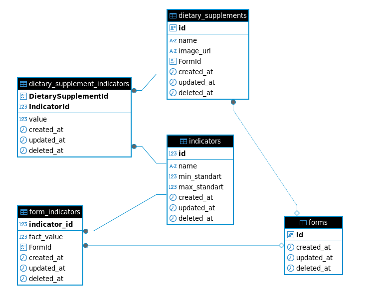

# Тестовое задание для Biogenom
Разработан сервис, реализующий все endpoint-ы, необходимые для работы экрана с результатами краткой оценки качества питания.

## Endpoints
Реализованные endpoints:
- **GET** api/indicators/low (получение показателей со сниженным суточным потреблением)
- **GET** api/indicators/normal (получение показателей с нормальным суточным потреблением)
- **GET** api/indicators/new (получение списка показателей с информацией об изменении суточного потребления при приёме БАДов и изменении питания)
- **GET** api/dietary_supplements (получение списка рекомендуемых БАДов)

## Кодовая база
Код проекта находится в папке /src

Код контроллеров можно найти по пути /src/application/restControllers

Код по работе с БД можно найти по пути /src/infrastructure/repositories

## БД
Реализовано подключение к PostgreSQL через EF CORE и Npgsql.

Включение всех сервисов в DI вынесено в методы-расширения.

Описания моделей для БД вынесены в отдельные конфигурации для каждой.

### Репозитории
Конкретные репозитории, включая базовый, имплементируют интерфейс IRepository<T>. Это позволяет в будущем, при нужде, более мягко поменять СУБД, так как репозитории не зависят от конкретной реализации DbContext.

### Диаграмма

### *Form
Добавил модель Form и её конфигурацию в БД. Некий намёк на будущую реализацию работы с несколькими анкетами (так как на самом деле приложение многопользовательское).
Но! Реализации этого функционала в контроллерах нет, так как это противоречит заданию.

## Логика
Логика вынесена в отдельные сервисы, имплементирующие соответствующие интерфейсы.

## Контроллеры
Реализуют валидацию данных перед отправкой пользователю.
Для своей работы принимают объекты сервисов, имплементирующие соответствующие интерфейсы.

# Запуск
В корне проекта лежит файл example.env, который необходимо откопировать, переименовав в dev.env или prod.env (в зависимости от того, как хотите запустить проект).
Все поля *.env необходимо заполнить данными для подключения к PostgreSQL, после можно запускать. 
